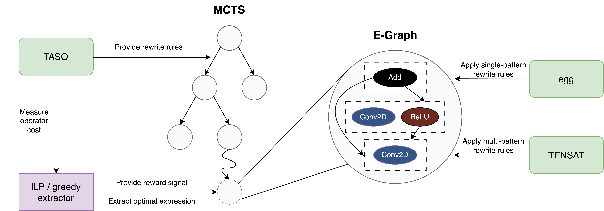

# Introduction
This repository accompanies the paper *"Optimizing Tensor Computation Graphs with Equality Saturation and Monte Carlo Tree Search"* which was submitted to the International Conference on Parallel Architectures and Compilation Techniques (PACT) 2024. The repository builds on top of four other projects:

1. Z. Jia et al., [TASO: Optimizing Deep Learning Computation with Automatic Generation of Graph Substitutions](https://dl.acm.org/doi/10.1145/3341301.3359630), SOSP ’19, 2019. TASO provides the rewrite rules, and measures the operator and graph runtimes on our hardware. We use [this version](https://github.com/yycdavid/taso) of TASO without any modifications.
2. M. Willsey et al., [egg: Fast and extensible equality saturation](https://dl.acm.org/doi/10.1145/3434304), POPL, 2021. egg is the equality saturation framework underyling our work. We have slightly modified [this version](https://github.com/egraphs-good/egg) to fit our needs.
3. Y. Yang et al., [Equality Saturation for Tensor Graph Superoptimization](https://proceedings.mlsys.org/paper_files/paper/2021/file/cc427d934a7f6c0663e5923f49eba531-Paper.pdf), MLSys, 2021. TENSAT serves as our baseline and provides important functionality such as the application of multi-pattern rewrite rules. We have modified [this version](https://github.com/uwplse/tensat) to implement, among other things, our proposed cost function.
4. He et al., [MCTS-GEB: Monte Carlo Tree Search is a Good E-graph Builder](https://dl.acm.org/doi/abs/10.1145/3578356.3592577), EuroMLSys, 2023. Our tensor program optimizer is built on top of the [Rust-based implementation](https://github.com/hgl71964/rmcts) of MCTS-GEB.

Below is an overview of our tensor program optimizer using equality saturation and MCTS. All code artifacts except for TASO are included in this repository.




# Installation
## Prerequisites
- We used the following hardware to run our experiments:
    - CPU: Intel Xeon Gold 6142 CPU @ 2.60GHz with 8 cores 
    - RAM: 64 GB
    - GPU: NVIDIA Tesla P100 16GB
- Software requirements:
    - Ubuntu 22.04 LTS
    - NVIDIA driver and [NVIDIA Container Toolkit](https://github.com/NVIDIA/nvidia-container-toolkit)


## Instructions
1. Clone this repository: 
    ```
    git clone https://github.com/jakobhartmann/tensor-eqs-mcts.git
    ```
2. Change directory: 
    ```
    cd /tensor-eqs-mcts
    ```
3. Clone the TASO repository: 
    ```
    git clone https://github.com/yycdavid/taso.git
    ```
4. Change directory: 
    ```
    cd /tensat/docker
    ```
5. Run the Dockerfile to install the dependencies: 
    ```
    docker build --tag tensat:1.0 .
    ```
6. In the `run_docker.sh` file, change the source parameters to the correct folder paths.
7. Start the Docker container: 
    ```
    ./run_docker.sh
    ```
8. Inside the Docker container, install TASO:
    ```
    cd /usr/TASO
    mkdir -p build
    cd build
    cmake ..
    sudo make install -j10
    cd /usr/TASO/python
    python setup.py install
    ```
9. Inside the Docker container, install the ILP solver:
    ```
    sudo apt-get update
    sudo apt-get install coinor-libcbc-dev
    ```


## Troubleshooting
If you receive an error message similar to `libstdc++.so.6: version 'GLIBCXX_3.4.20' not found` when trying to run the experiments, follow [these instructions](https://stackoverflow.com/a/73101774) to resolve the issue.


# Experiments
- In our experiments, we evaluate a) our proposed cost function for greedy extractors and b) compare the performance of our tensor program optimizer to TENSAT. We use the following neural networks architectures as benchmarks: BERT, Inception-v3, MobileNet-v2, NASNet-A, NASRNN, ResNet-50, ResNeXt-50, SqueezeNet, and VGG-19.  We repeat all experiments five times to account for the randomness of MCTS and the stochasticity of the cost model.
- To run our optimizer, use `/rmcts/run_experiments.sh`. The script will automatically run experiments across different cost functions, neural network architectures, and seeds. The hyperparameters of our optimizer can be changed in `/rmcts/src/main.rs`.
- For TENSAT, use `/tensat/run_exp_main.sh` to automatically run all experiments with our default settings. The hyperparameters can be changed in the script.


# Evaluation
- The experimental results for TENSAT are saved in `/experiments/tensat` and follow the naming convention `{model}_{k_multi}_{run}`. Each folder contains the following files:
    - `stats.txt`: Optimization results including original graph runtime, optimized graph runtime, and optimization time.
    - `iteration_data.txt`: Detailed information for each iteration including which single-pattern rewrite rules were applied to the e-graph.
    - `hook_iteration_data.txt`: Information for each iteration on which multi-pattern rewrite rules were applied to the e-graph.
    - `start.model` and `optimized.model`: Serialized version of the input and output tensor program.
    - `start.svg` and `ext.svg`: Visualization of the original and final e-graph.
    - `settings.txt`: Settings for the experiment.
    - `ilp_data_main.json` and `solved_main.json`: Files used and outputed by the ILP solver.
- The experimental results for our optimizer are saved in `/experiments/tensor_eqs_mcts`. Each folder corresponds to a combination of main and final extraction method and each subfolder corresponds to one model and run. Each subfolder contains the following files:
    - `rmcts_stats.txt`: Optimization results including original graph runtime, optimized graph runtime, and optimization time.
    - `rmcts_iteration_data.txt`: Detailed information for each MCTS iteration including which single- and multi-pattern rewrite rules were applied to the e-graph.
    - `start.model` and `optimized.model`: Serialized version of the input and output tensor program.
    - `start.svg` and `ext.svg`: Visualization of the original and final e-graph.
    - `settings.txt`: Settings for the experiment.
    - `ilp`: The folder includes files used and outputed by the ILP solver. Only present for experiments that use an ILP solver.
- We provide Jupyter notebooks to aggregate and process the experimental results.